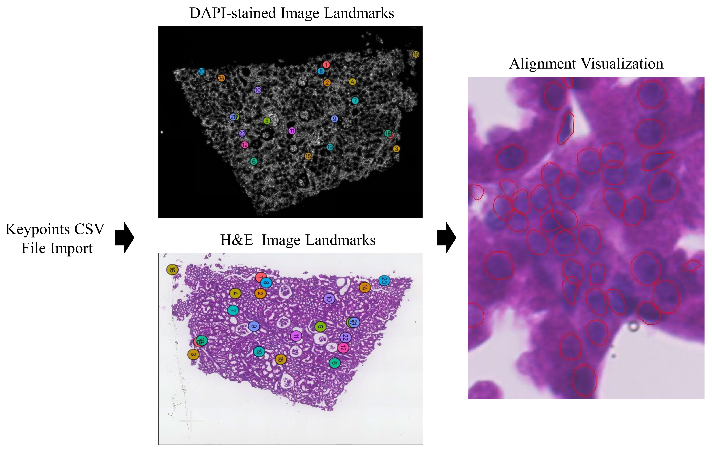

# Xenium-Alignment

## A software tool to generate keypoints for the alignment between H&E image and DAPI-stained image in Xenium Explorer

The Xenium Explorer is a desktop application that allows you to interactively visualize RNA transcript localization in tissues with subcellular resolution from data generated by the Xenium Analyzer instrument. The keypoints are the marked nuclei locations of H&E image and DAPI-stained image, which can be exported after placement or imported after generation as csv file. We develope a software tool, Xenium-Alignment, that can generate the keypoints file for Xenium Explorer. The keypoints import is shown as follows:



--------------------------------------------------------------------------------

### System and OS Requirements: 

Xenium-Alignment can run on both Linux and Windows. The developed tool has been tested on a computing server with 2.2 GHz, 144 cores CPU, 503 GB RAM and one NVIDIA TU102 [TITAN RTX] GPU under an ubuntu 18.04 operating system.

### Install Xenium-Alignment from Github:

```bash
git clone https://github.com/YuLin-code/Xenium-Alignment.git
cd Xenium-Alignment
```

### Python Dependencies: 

Xenium-Alignment depends on the Python scientific stack and python virutal environment with conda (<https://anaconda.org/>) is recommended.

```shell
conda create -n Xenium_Alignment python=3.9
conda activate Xenium_Alignment
pip install -r requirements.txt
```

More tutorial information about how to use Xenium-Alignment can be checked at the [tutorial](https://github.com/YuLin-code/Xenium-Alignment/tree/master/tutorial).

## References:

1. Cellpose <https://github.com/MouseLand/cellpose>
2. Squidpy <https://github.com/scverse/squidpy>
3. SPACE-GM <https://gitlab.com/enable-medicine-public/space-gm>
4. Spatial-ConGR <https://github.com/YuLin-code/Spatial-ConGR>