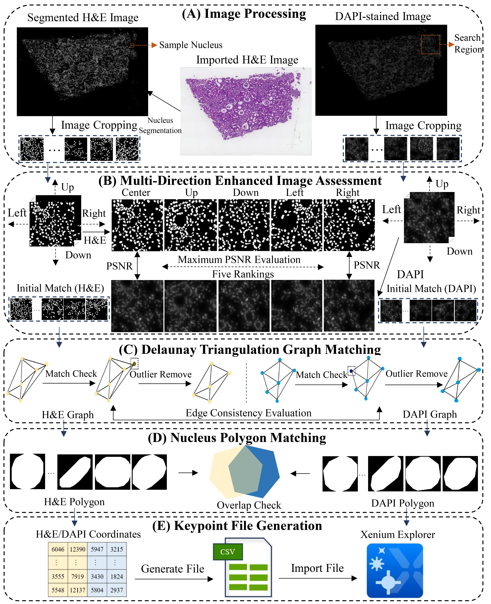

# Xenium-Align

## Defining keypoints to align H&E image and Xenium DAPI-stained image automatically

Defining matched keypoints between the aligned images is a critical method to implement image alignment. However, it is a labor-costing work of manually placing keypoints when using the Xenium Explorer software. Xenium-Align is a keypoints identification method that can generate the keypoints file for automatic image alignment in Xenium Explorer to visualize the imported H&E image and Xenium DAPI-stained image. The main workflow of Xenium-Align is shown as follows:



--------------------------------------------------------------------------------

### System and OS Requirements: 

Xenium-Align can run on both Linux and Windows. The developed tool has been tested on a computing server with 2.2 GHz, 144 cores CPU, 503 GB RAM and one NVIDIA TU102 [TITAN RTX] GPU under an ubuntu 18.04 operating system.

### Install Xenium-Alignment from Github:

```bash
git clone https://github.com/YuLin-code/Xenium-Align.git
cd Xenium-Align
```

### Python Dependencies: 

Xenium-Align depends on the Python scientific stack and python virutal environment with conda (<https://anaconda.org/>) is recommended.

```shell
conda create -n Xenium_Alignment python=3.9
conda activate Xenium_Alignment
pip install -r requirements.txt
```

More tutorial information about how to use Xenium-Alignment can be checked at the [tutorial](https://github.com/YuLin-code/Xenium-Align/tree/master/tutorial).

## References:

1. Cellpose <https://github.com/MouseLand/cellpose>
2. Squidpy <https://github.com/scverse/squidpy>
3. SPACE-GM <https://gitlab.com/enable-medicine-public/space-gm>
4. Spatial-ConGR <https://github.com/YuLin-code/Spatial-ConGR>